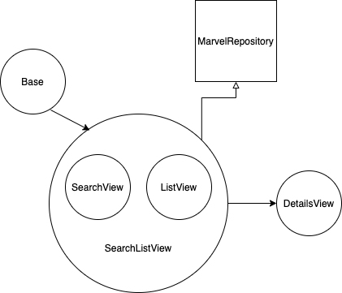

#  Superhero Directory

Superhero directory is a listing of all your favorite superheroes and information about them

## Meta

**State:** Version 0.1

**Author:** [Matthew Korporaal](mailto:matthew.korporaal@gmail.com)

----------

- [Requirements](#requirements)
- [Dependencies](#dependencies)
- [Installation](#installation)
- [Running the project](#running-the-project)
- [Run Tests](#run-tests)
- [Technical Overview](#technical-overview)
- [Screen Details](#screen-details)
- [Web Services](#web-services)

---

## Requirements

- iOS 11.0+ / macOS 10.13+
- Xcode 13+
- Swift 5.0

---

## Dependencies

Core: Foundation, UIKit, [Nuke](https://github.com/kean/Nuke) 

Tests: XCTest, [Quick](https://github.com/Quick/Quick), [Nimble](https://github.com/Quick/Nimble), [SnapshotTest](https://github.com/pointfreeco/swift-snapshot-testing)

---

## Installation

Enter `git clone https://github.com/chewch/SuperHeroDirectory.git` in a terminal window. After downloading, it can immediately be run from Xcode, no additional steps are required.

---

## Running the project

To run the app from Xcode, open the workspace file `SuperHeroDirectory.xcworkspace` and run the Scheme `SuperHeroDirectory`. Choose a simulator, and `⌘R`

---

## Running Tests

To run the tests , open the workspace file `SuperHeroDirectory.xcworkspace` and run the Scheme `SuperHeroDirectoryTests`. Choose a simulator, and `⌘U`

---

## Technical Overview

#### Architecture: 

The app is using a VIPER clean architecture variant. Each component has a clear separation of responsibilities. It also adopts a pattern from Android with the idea of a two-way data flow between presentation, domain and data layers. The interactors have been omitted since there was an extra layer of abtraction and unecessary due to the use of the use case to handle the business logic

#### Data Flow:

The data flow follows the route from:

- presentation layer (UI -> ViewModels/Presenter -> UseCases)  to 
- domain layer (Presenter -> UseCases) to
- data layer (UseCases -> Repositories)

Once data is retrieved locally or remotely in the repositories, it then flows back thru the use cases which transforms the data. The use case updates the presenter with data or error, then the presenter translates it to view model for the UI.

https://proandroiddev.com/clean-architecture-data-flow-dependency-rule-615ffdd79e29

#### Setup, Navigation:

Each module has its own container that lists everything it needs for getting data. The container builds all of the dependencies, then passes them to the router. The router asks the wireframe to build the module, and injects the containers use case in the presenter, and finally, is ready to start the UI.

#### Views, Layout:

Both screens use a table view. Since, the first “SearchList” screen cell is simple, I created it manually and added anchor constraints. The “Details” screen is more complicated, so I used a nib for the cell. Used [NibLoadable](https://github.com/AliSoftware/Reusable/blob/master/Sources/View/NibLoadable.swift) to easily load nibs without stringly type.

#### App Styling:

Views: styles are built using functional composition and the pipeline operator |>. A composable style (background or text colour, or any property) is created, by passing the view to the method, change and returned in a block. The returned block can be added together (i.e. tableViewStyle = clearTableViewStyle + superLightGreyBackgroundStyle…), then applied to the view using the pipeline operator (i.e. tableView |> tableViewStyle). This custom operator makes the code very clean.
[Article Link](https://www.pointfree.co/blog/posts/5-styling-with-functions-free-for-everyone)

Colours: uses an idea from [SwiftGen](https://github.com/SwiftGen/SwiftGen) which is a small wrapper around UIColor to map RGB values to a static variables

#### Localizable: 

The localised string scheme is based on how [SwiftGen](https://github.com/SwiftGen/SwiftGen) implements. The string key is used as a path. Each segment is an enum with the last being a static variable that uses a helper to translate the key.  This avoids “stringly” typed keys.

#### Networking:

The app can handle a Request which is a lightweight wrapper around URLSession to fetch using a task and decode generic data or return an error. Task contains everything necessary to make the request. Rates are fetched handled using an extension on Array with a DispatchGroup. A lightweight 

#### Promise:

(Promises.swift) class is used to map data and error to result enum which can be observed in the networking and business layer. In SearchListPresenter, you can see how it handles response with chained `onSuccess` and `onError` promise methods.

#### Cache:

There is no stored data, but image caching is handled automatically by [Nuke](https://github.com/kean/Nuke) library. Marvel backend sends cache 304 response if the same call has recently happened.

#### Error Handling:

Network can handle basic HTTPError, these are shown with an activity sheet.
DecodingError are thrown when decoding data, and currently the app will fail
fatalErrors are thrown when necessary

#### Universal app:

The app supports portrait and landscape. It uses the readable content width on iPad and uses iOS 10 layout guides when necessary. I have tested the app on an iPhone 5 (iOS 10), 8 (iOS 12), and X (iOS 13), as well as the iPad pro (iOS 13) simulators and have not seen any issue. *Note: the app is currently iOS 11+, so the layout guides are not currently used. If an older Nuke version is used, then iOS 10 could be supported. I wanted a newer Nuke api, so I opted to leave out iOS 10 here.

#### Tests:

There is XCTest integration test for the repository and some mocks. Quick & Nimble matchers used for Presenter tests. [SnapshotTest](https://github.com/pointfreeco/swift-snapshot-testing) library by the point-free guys is used for device agnostic ui testing along with Quick. All snapshot tests are located the unit test directory to allow the `@testable` macro to be used. More testing should be done

---

## Screen Details

  

The app consists of:

- List of all characters
- These can be filtered by searching characters by name in search bar
- Details of each character is shown when available from api
        
#### Screen level detail of the app: 


**SearchList**: A list of all characters are shown 50 at a time. If you scroll to the bottom and pull, more will be fetched 50 at a time. Using the search bar, you can filter characters by name. Tapping the *x* or tapping outside the search bar will release control. Tapping *Cancel* button reloads the unfiltered list from the beginning.

**Details**: When the desired character is selected from the *SearchList*, the details are shown on the next screen.  

## Web services 


The app retrieves information from the *developer.marvel.com* endpoint and interfaced by MarvelRepository.swift and the networking layer
